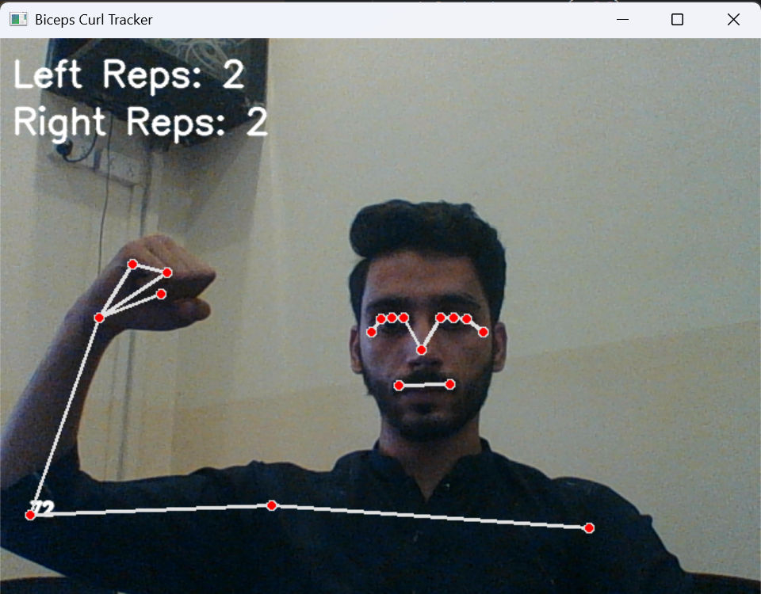
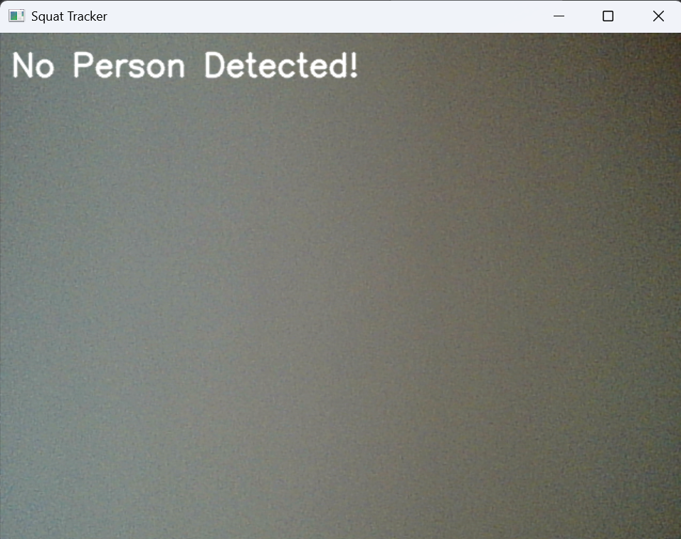

# 🏋️ Posture Tracker — Mediapipe-Based Exercise Analyzer

> A Python-powered fitness posture tracking app that uses **Mediapipe Pose** and **OpenCV** to detect body landmarks in real time, analyze posture, and automatically count exercise repetitions.

---

## 📌 Project Summary

Posture Tracker is a computer vision application that helps users perform exercises with correct form. Using **Mediapipe**’s real-time pose estimation, it tracks key body landmarks and calculates joint angles to give feedback on form. The app supports multiple exercises such as **bicep curls, squats, push-ups, and planks** — with rep counting and posture correction guidance.

---

## ⚙️ Features

* 🎥 **Real-Time Camera Feed** using OpenCV
* 🏋️ **Exercise Tracking** – Bicep Curls, Squats, Push-Ups, and Planks
* 📊 **Automatic Rep Counting** based on joint angle calculations
* ✅ **Posture Feedback** – provides guidance like “Too Shallow!”, “Go Lower!”, or “Perfect Form!”
* ✨ **Visual Landmark Overlay** – skeleton drawn over body for feedback clarity

---

## 🧰 Tech Stack

| Component       | Tool           |
| --------------- | -------------- |
| Language        | Python 3.10     |
| Computer Vision | OpenCV         |
| Pose Detection  | Mediapipe Pose |
| Math / Angles   | NumPy          |

---

## 🗂 Folder Structure

```bash
PostureTracker/
├── images/                   # Exercise screenshots (sample output)
├── PoseTracker.py            # Main posture detection script
├── requirements.txt          # Dependencies list
└── README.md
```

---

## 📝 Setup Instructions

### 🔧 1. **Install Requirements**

```bash
pip install -r requirements.txt
```

Dependencies:

* `opencv-python`
* `mediapipe`
* `numpy`

### 🎥 2. **Camera Access**

Make sure your webcam is connected. If you have multiple cameras, update the index in:

```python
self.cap = cv2.VideoCapture(0)   # Change 0 → 1 if needed
```

### 🚀 3. **Run the App**

```bash
python PoseTracker.py
```

Press **`q`** anytime to quit the exercise window.

---

## 📷 Screenshots

| Bicep Curl Detection       | Squat Detection       |
| -------------------------- | --------------------- |
|  |  |

---

## 📩 Contact

👤 **Usama Shahid**
📧 Email: [dev.usamashahid@gmail.com](mailto:dev.usamashahid@gmail.com)

Feel free to reach out for:

* 🧑‍💻 Code explanation
* 🏋️ Fitness-tech collaboration
* 🤝 Guidance and improvements

---

## 📜 License

This project is for academic and personal fitness purposes only. Fork, experiment, and build upon it, but please give credit where due 🙏
